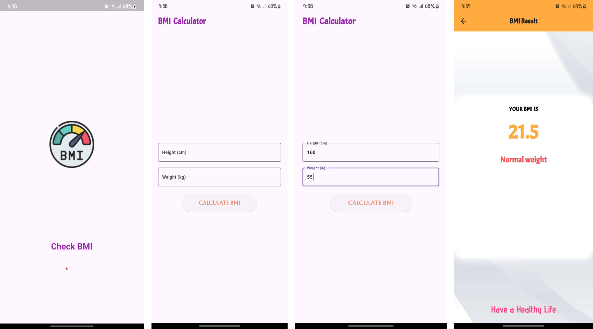

# bmi_calculator_app

Simple BMI calculator  app example with splash screen, value insert part  and result page

## What we will learn from this project

- How to create splash Screen
- Learn about Progress Indicator
- How to use Column and Row
- How to use container, image and text widget
- How to use animation for a text
- How to pass data between two screen
- How to add picture in full background
- How to use custom google fonts
- How to use MediaQuery
- How to design a result page
- How to added toast message

## Getting Started

This project is a starting point for a Flutter application.

A few resources to get you started if this is your first Flutter project:

- [Lab: Write your first Flutter app](https://docs.flutter.dev/get-started/codelab)
- [Cookbook: Useful Flutter samples](https://docs.flutter.dev/cookbook)

For help getting started with Flutter development, view the
[online documentation](https://docs.flutter.dev/), which offers tutorials,
samples, guidance on mobile development, and a full API reference.
